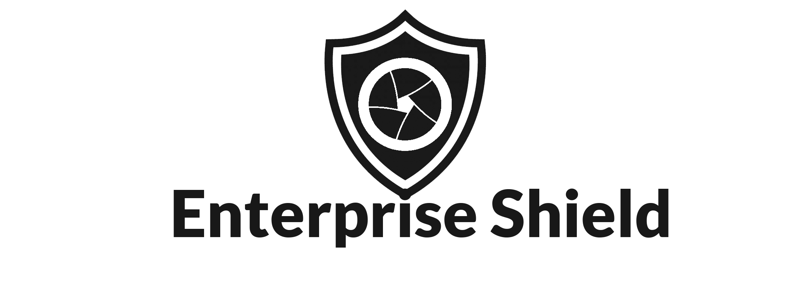

<h1 style="color: #3a7aad">The Enterprise Shield</h1>
<h2 style="color: #3a7aad">A Defense Against Shoulder Attacks in Enterprises</h2>
<h4 style="color: #3a7aad">by Edward Crowder and Ahmad Chaiban</h4>

In this project, our task was to implement a Computer Vision detection system to defend against shoulder surfing in 
enterprises that have confidential information with different levels of security clearance. The system developed uses 
three different Machine Learning models as part of its stack in order to provide a rigorous threat level assessment 
system. 

The first layer of detection is facial recognition, which uses 
<a href = "https://github.com/ageitgey/face_recognition" target="_blank">this</a> facial recognition library 
developed by Adam Geitgey. It is quite robust and requires merely a single image in order to make an accurate 
classification of unknown, unauthorized or authorized actors. The second layer uses 
<a href = "https://pjreddie.com/darknet/yolo/" target="_blank">YOLOv3</a> in order to detect any possible approaching 
or loitering actors in the background. The third and final layer tracks the gaze of the user using Antoine Lamé's 
<a href = "https://github.com/antoinelame/GazeTracking" target="_blank">gaze tracking library</a>. This entire detection 
system is then used to return an aggregated score that assess the risk level of the machine. 

The required defenses are then implemented in order to defend the machine from any potential attack or leak caused 
by shoulder surfing. Note that for the moment, the security implementations currently only support MacOS, as they have 
been written with AppleScripts. 

<h2 style="color: #3a7aad">Risk Assessment Pipeline</h2>

The following figure summarizes the working pipeline. 

<center>
    
</center>

<h2 style="color: #3a7aad">File Structure</h2>

```
├── README.md 
├── TheEnterpriseShield.pdf
├── client
│   ├── main.py
│   ├── powershell_scripts
│   │   ├── hideWindows.ps1
│   │   ├── lockscreen.ps1
│   │   └── notification.ps1
│   └── security_features.py
├── doc_images
├── requirements.txt
└── server
    ├── app.py
    ├── azure
    │   ├── AzureConnector.py
    │   ├── parameter_dev.json
    │   └── parameters_prod.json
    ├── known_people
    │   ├── AhmadChaiban.jpg
    │   ├── DanielCraig.jpg
    │   └── EdwardCrowder.jpg
    ├── logs
    │   └── risk.csv
    └── models
        ├── face_classifier.py
        ├── gaze_tracking
        ├── weights
        └── yolo_human_detect.py
```

<h2 style="color: #3a7aad">Detection Example</h2>

The following unauthorized employee tried to access their senior manager's machine in disguise to no avail!

<center>
    
</center>

Note that the green box represents a human detection, the red box represents a facial recognition and the green 
crosses represent a gaze detection and track. 

<h2 style="color: #3a7aad">Presentation Video</h2>

Please click on the image below to view the presentation video on YouTube.

[](http://www.youtube.com/watch?v=0QWvsMx73jA "The Enterprise Shield - MCTI 6510 Project Presentation")


<h3 style="color: #3a7aad">Full Links to References</h3>

1. https://github.com/ageitgey/face_recognition
2. https://pjreddie.com/darknet/yolo/
3. https://github.com/antoinelame/GazeTracking

<h3 style="color: #3a7aad">Resources Considered</h3>

The following resources/libraries were considered but did not integrate well, or were not suitable for our design.

1. https://github.com/facebookresearch/detectron2
2. https://thedatafrog.com/en/articles/human-detection-video/

 